本项目是基于springboot+vue的前后端分离的宠物服务管理系统

项目代码已收录公众号【java项目源码】，需要请自行关注一下公众号并下载源码

功能：
用户登录注册、周边商品、宠物趣事、医疗服务、宠物资讯、留言反馈

用户：购物车查询、订单管理、服务预约管理、分享趣事管理、反馈问题管理、评论服务管理、个人中心、修改密码

管理员：管理员管理、密码修改、用户管理、充值管理、商品分类管理、商品信息管理、订单信息管理、分享趣事管理、医疗服务管理、
服务预约管理、评价管理、宠物资讯管理、系统管理（轮播图等）

运行视频请点击：[基于springboot+vue的前后端分离的宠物服务管理系统](https://www.bilibili.com/video/BV1k44y1k7RM/)

运行方式：
后端正常idea导入springboot项目并修改数据库连接的用户名和密码，
前端需要有nodejs环境，引入vscode获取idea中后，
运行脚本：yarn install 下载插件
然后运行脚本：yarn run serve  知道出现访问地址为止。

运行截图：

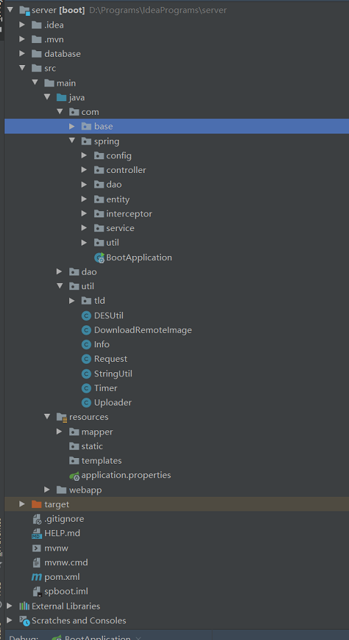
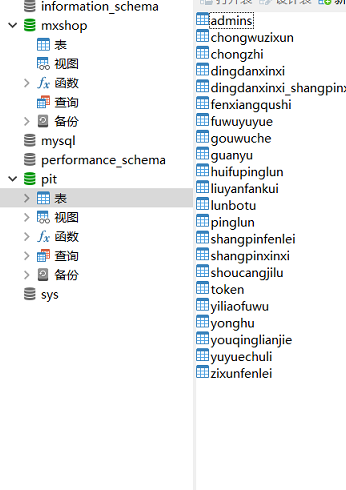

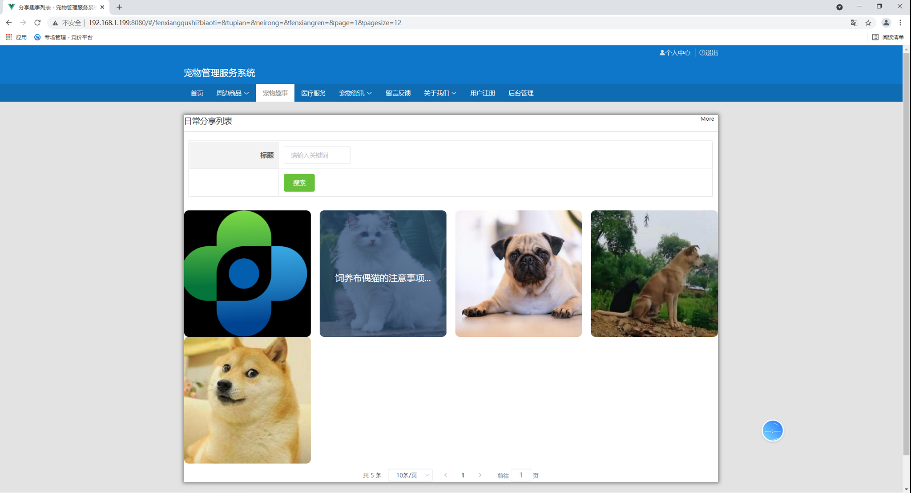
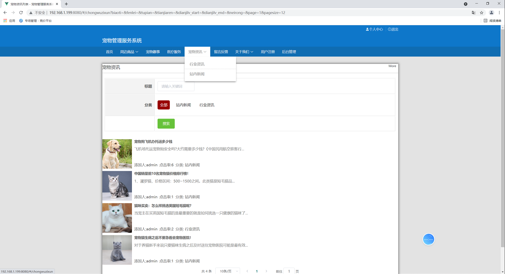
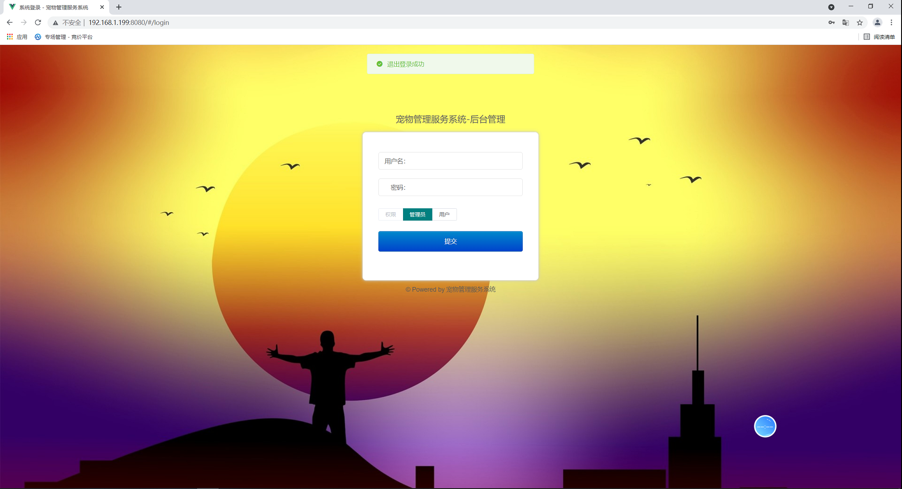
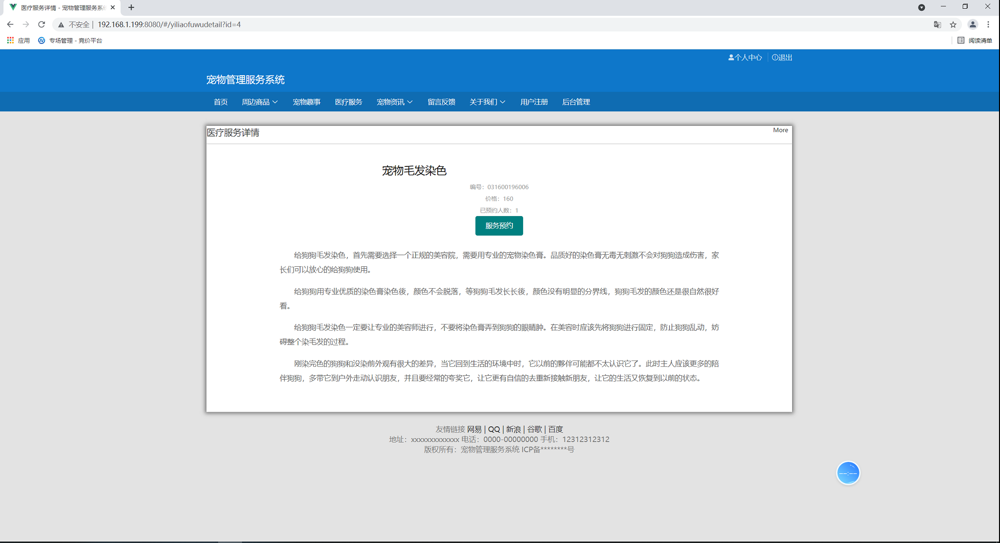
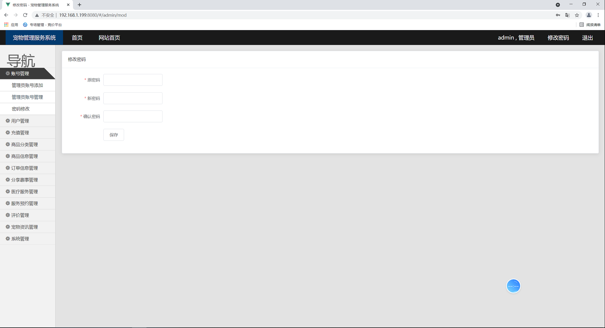
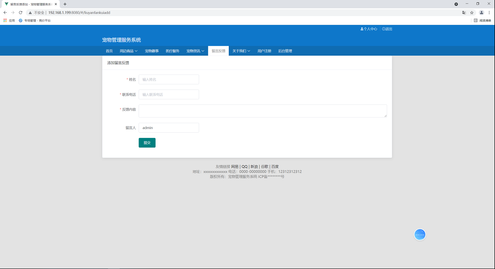
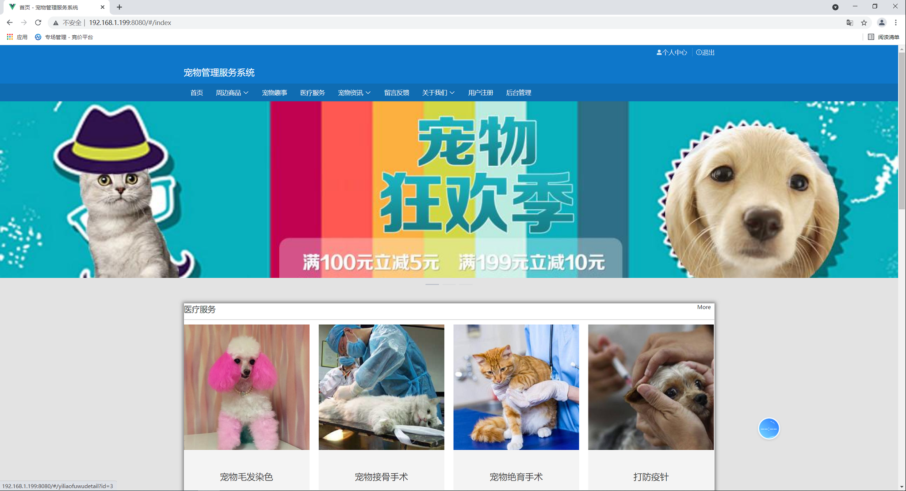
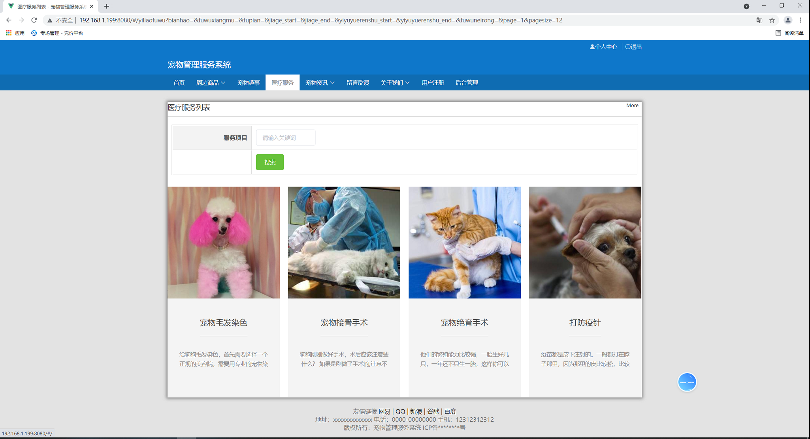
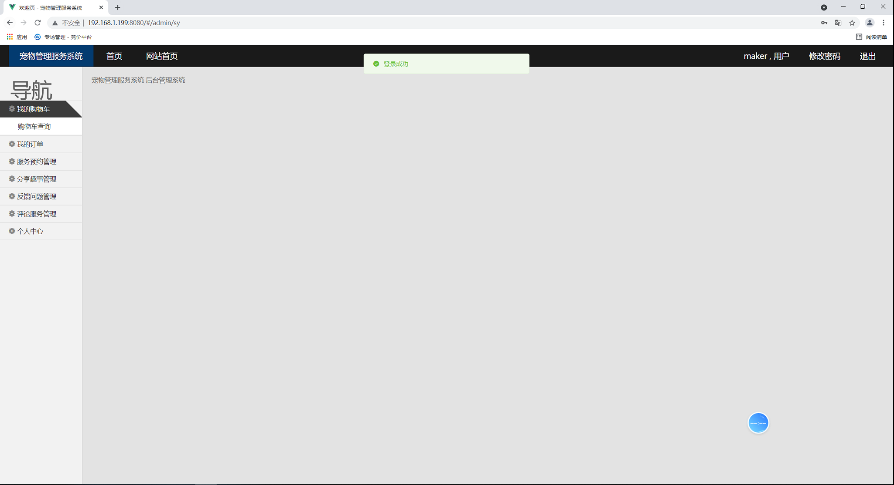
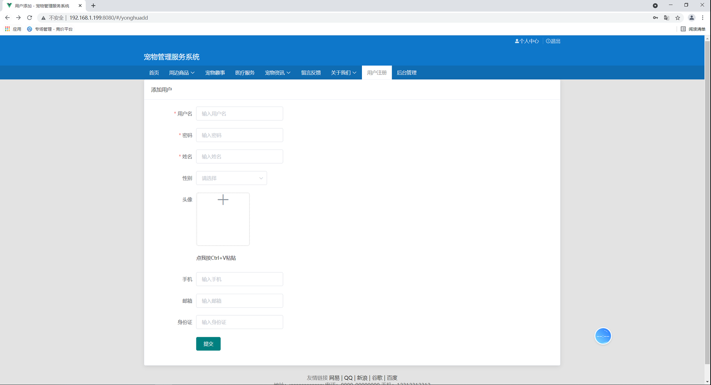
